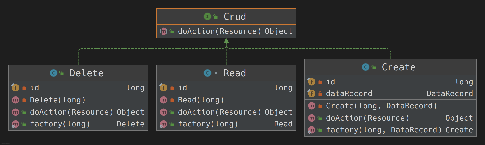

# Design Patterns
## Strategy Pattern
### What is the strategy pattern?
+ strategy pattern (also known as the policy pattern) is a behavioral software design pattern that enables selecting an
algorithm at runtime. Instead of implementing a single algorithm directly, code receives run-time instructions as to
which in a family of algorithms to use.

### How did I implement the strategy pattern?
+ I implemented the strategy pattern by providing a high-level abstraction (interface) as a contract for different modules
that serve a specific goal, but with difference in the algorithm/implementation of how the goal is achieved.
